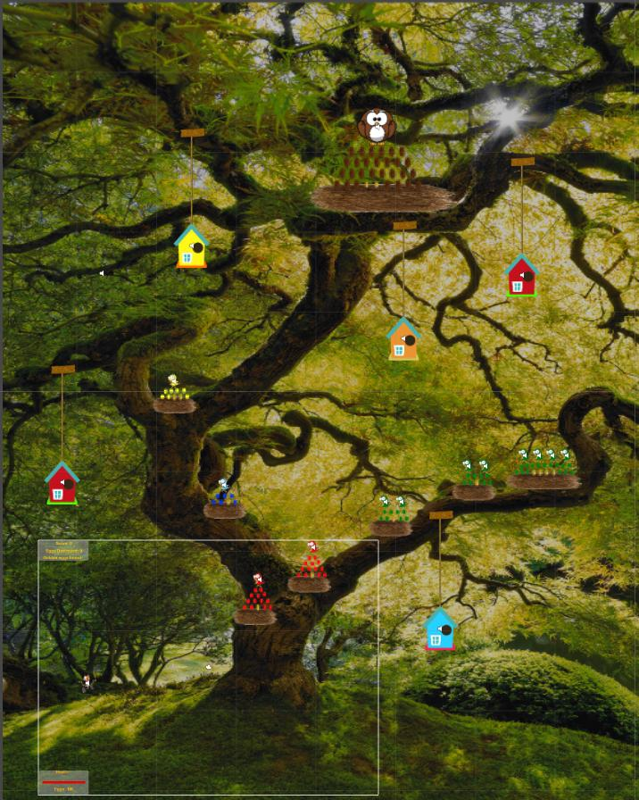

# Cuckoo-Quest

This is a concept/prototype of a level based 2D platform game which I made with Unity 2D. In this game you play as a cuckoo who needs to rescue all his brothers and sisters from other bird nest. In each level you have to collect all the cuckoo-eggs (the brothers and sisters) from the bird nests. During this adventure he finds out about the awful destiny that awaits him and his family and he therefore needs to find a way to change this destiny. 

This project/concept is a good start for anybody who is new to Unity 2D and wants to play around with it and get a quick grasp of how the Unity 2D game engine works. It uses many of the basic Unity 2D platform game development concepts like: colliders, triggers, rigid bodies (physics), moving enemies, very basic enemy AI, a player that can move and perform attacks (shooting eggs), explosions, sounds, an in-game canvas menu with player information (health and score), prefabs, some custom shaders, materials, and different scenes (levels).

Controls: 
A : Move left 
D : Move right 
S : Move down 
W : Move up  

Space : Shoot eggs 
E : Exploding egg 
Z : Change shooting direction counter-clockwise 
X : Change shooting direction clockwise  

 

You can open this project with the Unity IDE. The free version of Unity can be downloaded here: 
https://store.unity.com/
